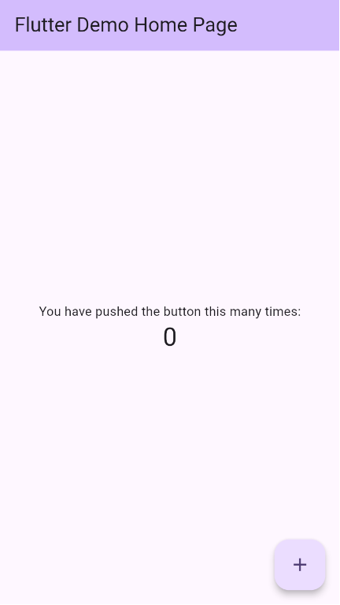

# LevelUp Vendas

Dashboard pessoal de vendas, metas, comissoes, desafios e gamificacao para uso diario.

O **LevelUp Vendas** foi criado para acompanhar performance comercial de forma simples, visual e motivadora. O app combina metas individuais, metas da loja, vendas diarias, comissao estimada, desafios ganhos, XP e evolucao de nivel em uma experiencia responsiva com visual premium em dark mode.

Autor: **Edson Pires**

## Funcionalidades

- Dashboard financeiro com visual premium.
- Cadastro de metas individuais e metas da loja.
- Cadastro de vendas diarias individual e loja.
- Calculo automatico de percentual mensal e semanal.
- Calculo automatico de comissao individual e comissao da loja.
- Registro de desafios ganhos com valor em dinheiro, data, tipo e observacao.
- Historico de desafios cadastrados.
- Acumulado mensal e geral por tipo de desafio.
- Gamificacao com XP, streak, badge de nivel e proximo nivel.
- Graficos modernos com `fl_chart`.
- PWA instalavel no celular.
- Tema dark com Material 3.
- Fallback local quando o Supabase nao estiver disponivel.

## Screenshots

> As imagens abaixo podem ser atualizadas conforme novas telas forem capturadas.



Sugestao de capturas futuras:

- `docs/screenshots/dashboard.png`
- `docs/screenshots/metas.png`
- `docs/screenshots/vendas.png`
- `docs/screenshots/desafios.png`
- `docs/screenshots/pwa-install.png`

## Stack Utilizada

- **Flutter Web**
- **Dart**
- **Material 3**
- **Riverpod**
- **GoRouter**
- **Supabase**
- **flutter_dotenv**
- **fl_chart**
- **google_fonts**
- **PWA**

## Arquitetura

O projeto usa uma arquitetura modular por feature, separando apresentacao, dominio, dados, servicos e componentes compartilhados.

```text
lib/
  core/
    config/
    constants/
    theme/
    utils/
  features/
    dashboard/
      presentation/
    desafios/
      data/
      domain/
      presentation/
    gamificacao/
      application/
      data/
      domain/
    metas/
      data/
      presentation/
    vendas/
      data/
      presentation/
  routes/
  services/
  shared/
    widgets/
```

### Camadas

- `core`: configuracoes globais, tema, constantes e utilitarios.
- `features`: telas e regras agrupadas por dominio do app.
- `domain`: modelos e regras de negocio.
- `data`: repositories e integracao com Supabase.
- `application`: controllers de estado com Riverpod.
- `shared/widgets`: componentes reutilizaveis de UI.
- `services`: servicos globais, como Supabase.
- `routes`: roteamento com GoRouter.

## PWA

O app esta configurado como Progressive Web App:

- instalavel no Android;
- `display: standalone`;
- icones personalizados;
- icones maskable;
- splash/loading inicial;
- tema dark no navegador;
- manifest otimizado;
- service worker gerado pelo Flutter Web no build.

Arquivos principais:

- `web/index.html`
- `web/manifest.json`
- `web/manifest.webmanifest`
- `web/icons/`

Para testar instalacao real em celular, publique a build em um host com HTTPS.

## Supabase

O app usa Supabase para persistir dados reais.

Tabelas esperadas:

- `metas`
- `vendas`
- `desafios`
- `gamificacao`

### Variaveis de ambiente

Crie um arquivo `.env` na raiz do projeto:

```env
SUPABASE_URL=https://seu-projeto.supabase.co
SUPABASE_ANON_KEY=sua-anon-public-key
```

Use `.env.example` como referencia.

### Desafios

O formato atual da tabela `desafios` usa registros individuais:

- `challenge_date`
- `challenge_type`
- `challenge_amount`
- `notes`
- `created_at`

Tipos permitidos:

- `store_goal`
- `pa`
- `biggest_ticket`

Existe uma migration de referencia em:

```text
supabase/migrations/001_desafios_registros_individuais.sql
```

Ela adiciona as colunas novas e migra registros antigos baseados em contadores.

## Flutter Web

O projeto roda como Flutter Web e pode ser executado em desenvolvimento com:

```bash
flutter run -d chrome
```

Ou via web-server:

```bash
flutter run -d web-server --web-hostname 127.0.0.1 --web-port 5173
```

Build de producao:

```bash
flutter build web --release
```

Os arquivos finais ficam em:

```text
build/web
```

## Instalacao

### Requisitos

- Flutter SDK instalado
- Dart SDK compatavel com o projeto
- Projeto Supabase configurado
- Navegador moderno

### Passos

1. Clone o repositorio.

```bash
git clone <url-do-repositorio>
cd levelup_vendas
```

2. Instale as dependencias.

```bash
flutter pub get
```

3. Configure o `.env`.

```bash
cp .env.example .env
```

Preencha:

```env
SUPABASE_URL=
SUPABASE_ANON_KEY=
```

4. Execute o app.

```bash
flutter run -d chrome
```

5. Rode as validacoes.

```bash
flutter analyze
flutter test
```

## Roadmap Futuro

- Login e autenticacao com Supabase Auth.
- Multiusuario com regras de RLS.
- Filtros por periodo no dashboard.
- Edicao e exclusao de vendas, metas e desafios.
- Exportacao de relatorios.
- Graficos comparativos por mes.
- Notificacoes de metas e streak.
- Modo offline com sincronizacao posterior.
- Tela de configuracoes de comissao.
- Testes de repository com mocks de Supabase.
- Deploy automatizado.

## Licenca

Este projeto esta sob a licenca MIT.

## Autor

**Edson Pires**

Projeto criado para acompanhamento pessoal de vendas, metas e evolucao comercial diaria.
